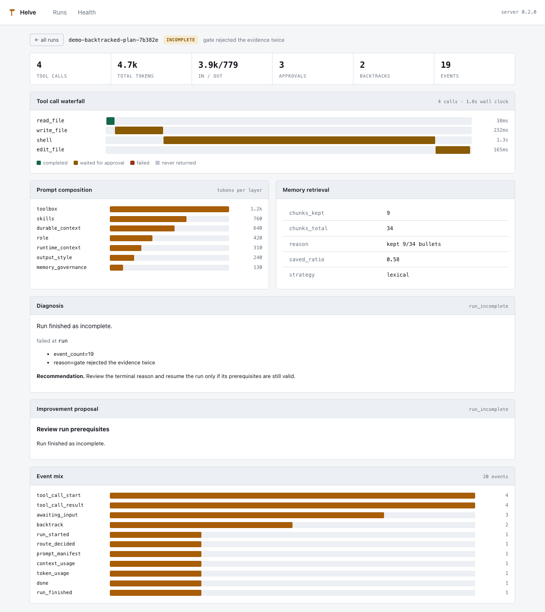
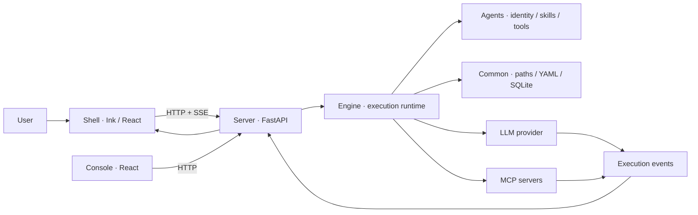

> A local-first, terminal-native agent workbench.
>
> *helve* /helv/ — the handle of a hammer: the part the human holds.

[](https://github.com/lumos-tiamo/Helve/actions/workflows/ci.yml)


Smith is a single, always-on agent that runs on your machine. It keeps
conversation context, accumulates memory across sessions, and switches workflows
through skills. One agent, one conversation — no sub-agents to reason about, no
routing layer between you and the work.

Everything runs locally: the shell, the API server, the execution engine, the
observability console and the SQLite database. The only outbound traffic goes to
the LLM provider you configure.

The name is the thesis. What distinguishes Helve is not that it runs an agent —
it is the non-bypassable tool guard, the approval gate in front of every write,
and the tamper-evident audit chain underneath. The agent is the head. You hold
the helve.

---

## The console



Every run is reconstructable: where the time went, how much of it was spent
waiting for a human, what the prompt was made of layer by layer, how much memory
was injected, and the engine's own account of any failure.

Approval waits are coloured separately from execution. A tool that blocked for
two minutes on a human is not slow code, and a chart that conflates them sends
you optimising the wrong thing.

---

## Why one agent

Multi-agent frameworks spend their complexity budget on orchestration —
delegation, hand-off protocols, shared scratchpads, and the failure modes each of
those introduces. Helve spends it on the single agent instead:

| Concern | How Helve handles it |
|---|---|
| Different task types | **Skills** — a task-specific workflow loaded into the prompt, not a separate agent |
| Multi-step work | **Skill chains** — declared pipelines with gates between stages |
| Long-lived context | **Memory** — compiled from evidence, retrieved per turn, not appended transcripts |
| Dangerous operations | **Tool guard + fact gate** — a non-bypassable boundary plus a challenge layer |
| Correctness of intermediate steps | **Gates** — a stage must produce its contract before the next one runs |

A sub-agent is not one more model call. It needs resource ownership, context
isolation, approval propagation, failure isolation and result aggregation. The
single chain was finished first; ephemeral sub-agent delegation landed only
afterwards, as a context-budget tool rather than a second resident agent.

---

## Five decisions worth defending

**Memory is retrieved, not injected whole.** `durable.md` used to go into every
prompt in full, so prompt cost grew with everything the agent had ever learned
and relevance was not a concept. It is now split into the bullets the writer
already addresses individually, ranked against the turn's request with BM25 plus
an optional embedder, and fused by Reciprocal Rank Fusion — ranks, not scores,
because BM25 is unbounded and cosine is [-1, 1], and normalising them against
each other invents a calibration nobody measured.

Measured on a 21-bullet labelled document across 12 queries: **92.9% recall at
51.9% mean token saving.** The recall floor is asserted in CI, so a ranking
regression turns the build red. Reporting the saving alone would mean nothing —
keeping nothing saves 100%.

Every failure path returns the whole document. Retrieval that silently drops the
bullet a turn needed is worse than one that costs tokens: the model simply stops
knowing something, and nothing anywhere reports it.

**The audit log is a hash chain.** Tamper-evident by construction, with an
explicit downgrade path for records written before the current format. Its
genesis namespace deliberately still carries the pre-rename name, because
changing it would re-root the chain and fail verification on every log written
before that day.

**Nothing writes without asking.** Tool guard is a hard boundary that skills,
pipelines and MCP tools cannot route around; writes pause for a human; the macOS
Seatbelt sandbox confines host execution. The eval suite *infers* which tools
should have paused from the ones actually called, so a new write path added to
the agent is covered by every existing case the moment it is used.

**As an MCP server, Helve offers knowledge and never actions.** It has always
been an MCP *client*; `POST /api/mcp` is the other direction, so Claude Code or
any host can ask this install what it has learned about your project. The
exposed surface is `memory_search` and `skills_list` — nothing that mutates.
Every write in this runtime pauses for a human, and an MCP caller has no human:
exposing one would mean blocking forever on an approval nobody answers, or
dropping the approval and turning the guard into decoration. Read-only
*filesystem* tools are out too, for an independent reason — an external caller
carries no workspace, and inventing one for them is how a guard gets bypassed by
accident.

**Dependencies flow one way.** `server → engine → common`. The engine never
imports FastAPI; `agents/` imports nothing at all — it is loaded at runtime, so
its contract is file shape, not Python types. The import graph and the tests both
enforce it.

---

## Architecture



| Layer | Directory | Responsibility |
|---|---|---|
| Infrastructure | `common/` | Paths, YAML config, SQLite, audit hash chain. No business logic. |
| Execution | `engine/` | LLM, ReAct loop, pipelines, memory + retrieval, skills, tools, safety, observability. No platform knowledge. |
| Content | `agents/` | Identity seed, pipelines, gates, conditions, tools, skills, hooks. Pure content. |
| Platform | `server/` | FastAPI: orchestration, session and agent lifecycle, HTTP endpoints. |
| Terminal UI | `shell/` | Ink shell. Talks to the server over local HTTP, auto-starts the backend. |
| Console | `web/` | React observability console, served by the backend at `/console`. |
| Evals | `evals/` | Scenario evaluation: natural language in, world state out. |
| MCP server | `server/app/mcp/` | What Helve offers *other* agents — knowledge, never actions. |

---

## Verified

Every figure below comes from a command in this repository, not an estimate.

| | |
|---|---|
| Engine tests | 1260 |
| Server tests | 278 |
| Shell tests | 305 |
| Eval-harness tests | 30 |
| CI | ubuntu + macOS matrix, five suites, container build and boot |
| Memory retrieval | 92.9% recall · 51.9% mean token saving |
| Scenario evals | 9/9 on sonnet-4-6 and opus-4-6, 8/9 on deepseek-v4-pro |

The macOS runner is not decoration. The Seatbelt sandbox only exists there, so
Linux alone would silently skip every sandbox test, and macOS alone would never
catch a Seatbelt test that fails rather than skips elsewhere — the two platforms
check each other. That matrix earned itself on its first run, catching a defect
no local run could see: `git commit` could decide to repack the memory-snapshot
repository mid-turn depending on the ambient git configuration, putting an
unbounded pause on the per-turn write path.

---

## Quick start

**Prerequisites:** Python 3.11+, [uv](https://docs.astral.sh/uv/), Node.js 22+.

```bash
# Backend
cd server && uv sync

# Terminal shell — build, then link `helve` onto your PATH
cd ../shell && npm ci && npm run build && npm link

# Observability console (optional; the backend serves it at /console)
cd ../web && npm ci && npm run build
```

Configure a provider:

```bash
export HELVE_LLM_PROVIDER=openai          # openai / anthropic
export HELVE_LLM_API_KEY="sk-..."
export HELVE_LLM_BASE_URL="https://api.openai.com/v1"
export HELVE_LLM_MODEL="your-model"
```

or write `~/.helve/config.yaml`:

```yaml
llm:
  provider: openai
  api_key: sk-...
  base_url: https://api.openai.com/v1
  model: your-model
```

Then, from any project directory:

```bash
helve
```

The backend starts automatically. The console is at
<http://127.0.0.1:8000/console>.

`npm link` symlinks the global `helve` to this working copy rather than copying
it, so it works from any directory and finds `server/` through its own install
path. The trade-off: it breaks if the repository moves, and it picks up source
edits only after `npm run build`. Verify with:

```bash
ls -l "$(which helve)"   # → .../lib/node_modules/helve-shell/bin/helve.js
```

### Docker

```bash
export HELVE_LLM_API_KEY=sk-... HELVE_LLM_MODEL=your-model
docker compose up
```

The image carries the backend only. The shell stays on the host — it is a
terminal UI, and the whole point of Helve is that a human is at the other end
of it.

### Context files

`~/.helve/HELVE.md` is your user-wide instruction file: it applies to every run.
A repository's own `.helve/HELVE.md` holds rules that belong to that project
only. Both are read while a run is assembled, so edits take effect on the next
request without restarting the backend.

Inside the shell, `/reload` starts a fresh session while keeping the previous one
in history.

### Upgrading from a pre-rename install

`~/.agent-smith` is migrated to `~/.helve` on first start, atomically and with
the SQLite sidecars, and the pre-rename environment variables and identity
schema are still accepted. Nothing to do by hand.

---

## Development

```bash
cd engine && uv run --extra test pytest tests    # 1260
cd server && uv run --extra dev  pytest tests    # 278
cd evals  && uv run --extra test pytest tests    # 30, offline
cd shell  && npm test && npm run check           # 305 + typecheck + lint
cd web    && npm run check && npm run build
```

Scenario evals call a real provider and cost money:

```bash
cd evals
uv run helve-eval --list
uv run helve-eval --tag safety
uv run helve-eval --model gpt-5 --model claude-sonnet-5   # comparison matrix
```

Developing the console without a provider:

```bash
uv run --project server python web/scripts/seed_demo_runs.py
```

Non-macOS contributors: a number of engine tests exercise the macOS Seatbelt
sandbox and skip elsewhere. A Seatbelt test that *fails* rather than skips on
Linux is missing its platform marker.

---

## Documentation

**Start with [`docs/README.md`](docs/README.md)** — the reading map. Every topic
has exactly one authoritative document, all written against the source.

| Where | What |
| --- | --- |
| [`docs/guide/`](docs/guide) | What Helve is, and getting it running |
| [`docs/architecture/`](docs/architecture) | Layers, one request end to end, glossary |
| [`docs/subsystems/`](docs/subsystems) | Loop, memory, context, tools & safety, sub-agents, LLM, MCP, observability, routing, skills, sandbox |
| [`docs/layers/`](docs/layers) | What each code layer owns |
| [`docs/project/`](docs/project) | Conventions, roadmap, external comparisons |
| [`evals/README.md`](evals/README.md) | What the eval harness measures, and what it refuses to |
| [`web/README.md`](web/README.md) | The console, and two bugs writing it uncovered |
| [`docs/subsystems/31-MCP-Server.md`](docs/subsystems/31-MCP-Server.md) | The outward MCP endpoint and the boundary on what it exposes |
| [`brand/README.md`](brand/README.md) | The mark, and why it is shaped that way |

Superseded drafts are not carried in the working tree — git history holds them,
which is what they were for. When documentation and code disagree, the code wins.

---

## Contributing

New capability? Add a **skill**, not an agent. The architecture boundaries in
[`CLAUDE.md`](CLAUDE.md) are enforced by the import graph and by tests — keep
`engine/` free of HTTP concepts, and keep `agents/` importing nothing.

## License

MIT
